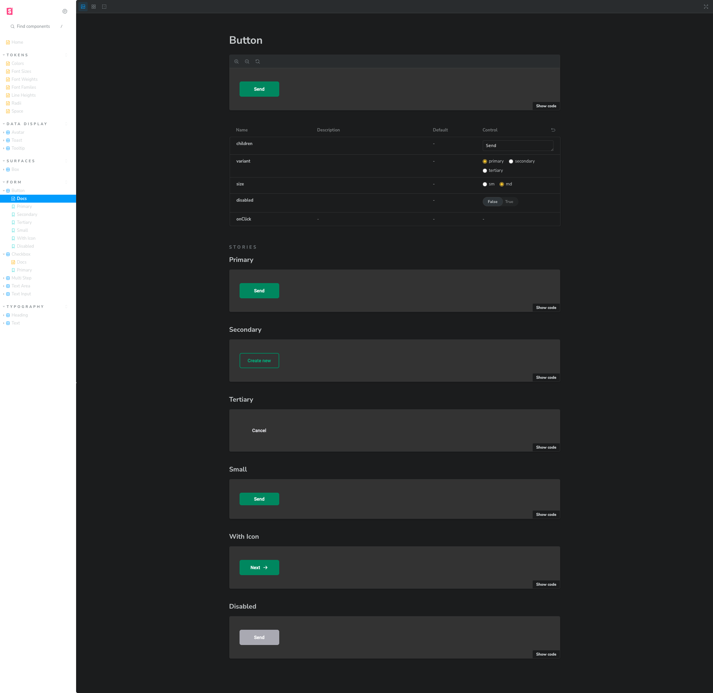
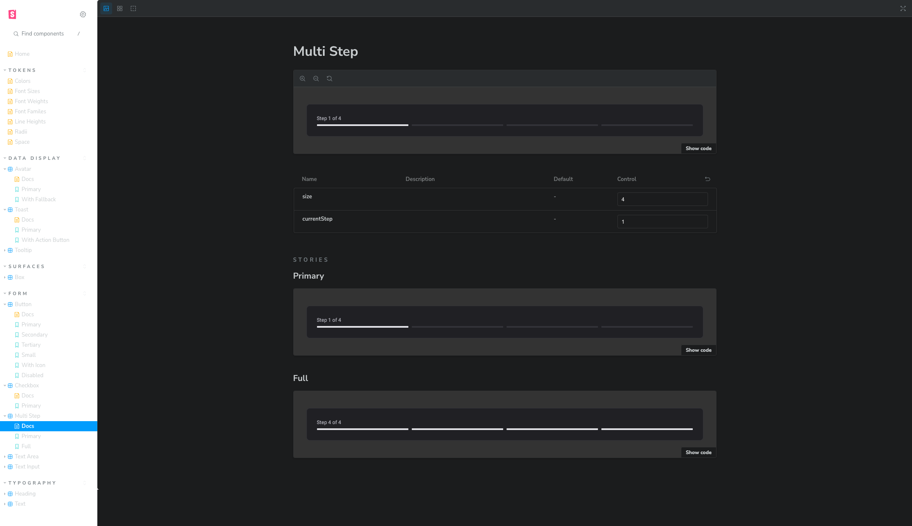
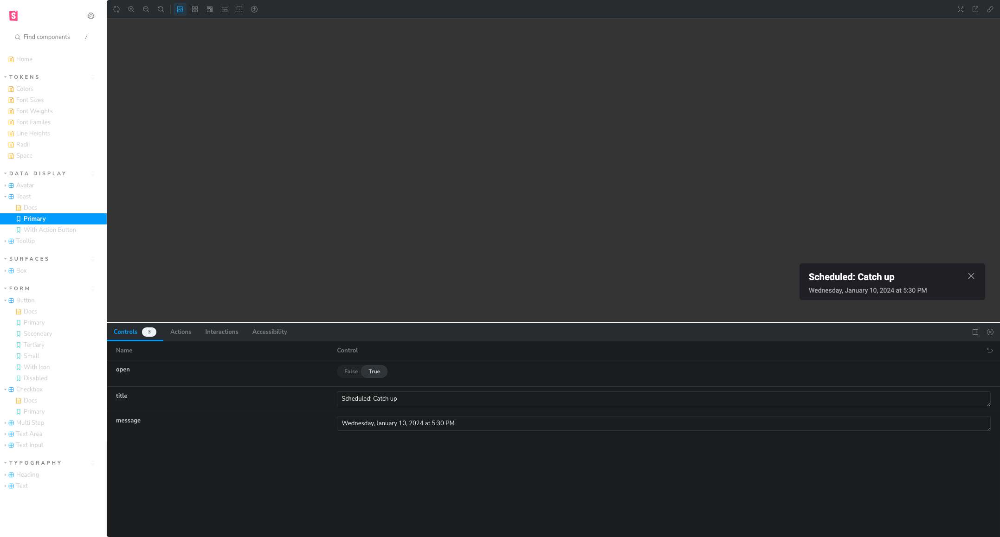

### Challenge 05 - Design System





#### 💻 Getting started

Storybook application.

Follow the steps below:
```bash
# Project dependencies
$ npm i

# Packages build and application initialization
$ npm run dev
```

The application will be initialized on the port: `6006`

#### 🌏 Storybook Page
https://wladimirgrf.github.io/05-design-system/?path=/docs/home--docs

#### 🔗 Challenge link
https://efficient-sloth-d85.notion.site/Desafio-05-Adicionando-mais-componentes-do-Design-System-62fe007e1bd143cb9c4af418b35bcf51